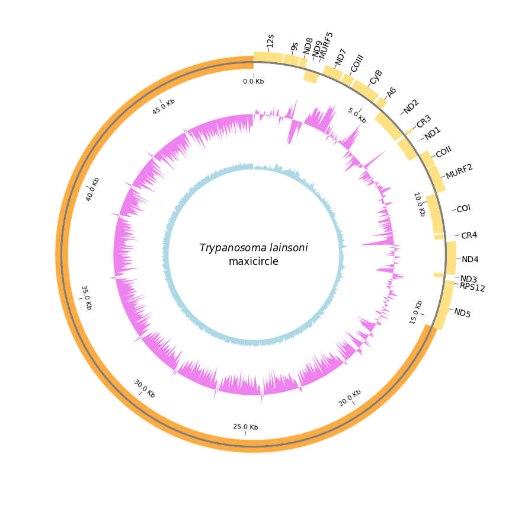

# kDNA-Maxicircle-circos

Python script for generating a circular genome map (circos plot) of a kinetoplast maxicircle DNA, including gene annotation, GC content, and GC skew tracks.

## Example output



## Description

This script generates a publication-quality circular map of a trypanosomatid maxicircle, displaying:

- **Outer ring:** annotated genes on forward and reverse strands, and divergent region
- **Middle ring (violet):** GC skew along the maxicircle
- **Inner ring (light blue):** GC content along the maxicircle
- **Center:** species name extracted automatically from the FASTA header

The plot adapts to any maxicircle length and any GFF annotation file.

## Requirements

- Python 3.7 or higher
- The following Python libraries (installed automatically if missing):
  - `biopython`
  - `pycirclize`

## Input files

- A **FASTA file** containing the maxicircle sequence (single record)
- A **GFF annotation file** with gene features

> **Note on species name:** the script extracts the species name from the first two words of the FASTA header (expected format: `>Genus_species ...`). If your header has a different format, edit the `title_text` variable in the script.

## Usage

### On your local machine

```bash
python maxicircle_circos.py
```

The script will ask you to enter the filename for each input file:

```
Enter the FASTA file (e.g. file.fasta): your_sequence.fasta
Enter the GFF annotation file (e.g. file.gff): your_annotation.gff
```

### On Google Colab

Upload the script and run it. The script will prompt you to upload your FASTA and GFF files directly from your computer through the Colab interface.

## Output

A high-resolution PNG figure (`maxicircle_circos.png`, 1000 dpi), ready for publication.

## Customization

All visual parameters can be adjusted at the top of the script:

| Parameter | Description | Default |
|-----------|-------------|---------|
| `window_size` | Window size for GC calculations (bp) | 50 |
| `xtick_interval` | Interval between axis ticks (bp) | 5000 |
| `track_color_forward` | Color for forward strand genes | #FFE082 |
| `track_color_reverse` | Color for reverse strand genes | #FFE082 |
| `track_color_divergent` | Color for divergent region | #FFAB40 |
| `plotstyle_cds` | Gene plot style (`box` or `arrow`) | box |

## License

This work is licensed under a [Creative Commons Attribution-NonCommercial 4.0 International License](https://creativecommons.org/licenses/by-nc/4.0/).

You are free to use and adapt this script for non-commercial purposes, as long as appropriate credit is given.

## Author

Fanny Rusman — IPE-CONICET, Salta, Argentina  
[](https://orcid.org/0000-0003-3995-9027)
